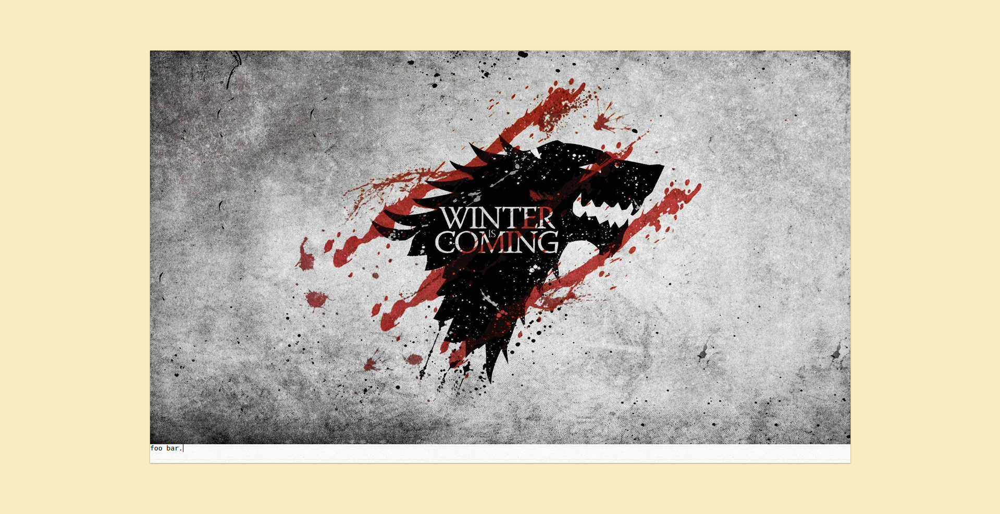
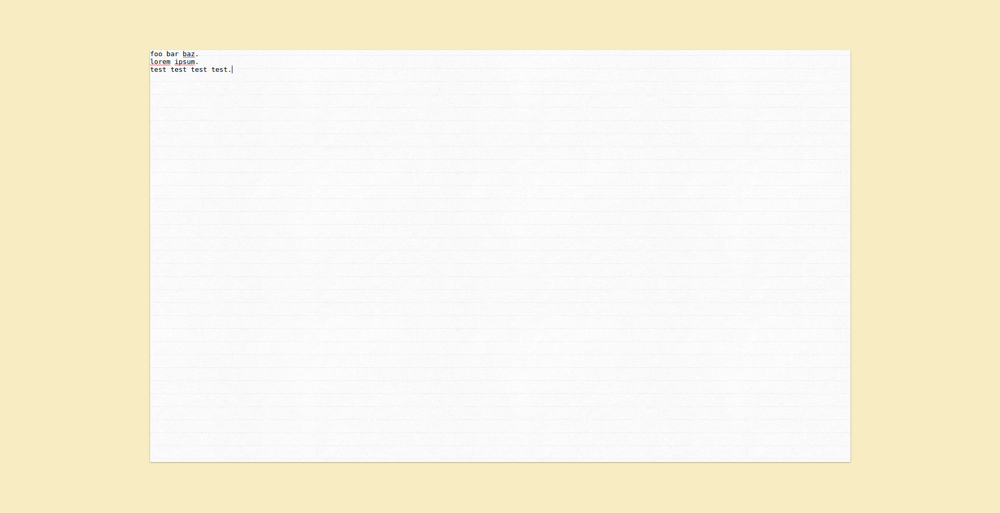
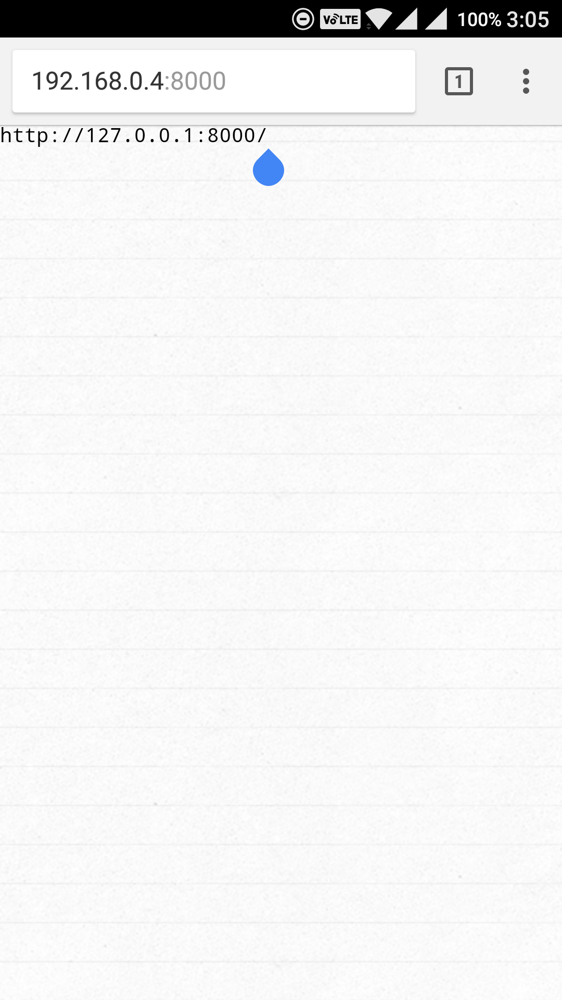
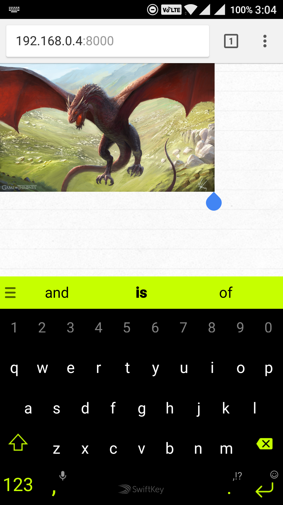

# clip-sync
clip-sync serves the text and images from your clipboard within the network.

## Index
  * [Dependencies](#dependencies)
  * [Installation](#installation)
  * [Screenshots](#screenshots)
  * [Contribute](#contribute)
  * [License](#license)

## Dependencies <a name="dependencies"></a>
  * python 3.5.2
  * webpack
  * gunicorn
  * Flask
  * eventlet
  * Flask-SocketIO

## Installation <a name="installation"></a>
  1. Install python & pip
  2. clone this repository
  ```
    $ git clone https://github.com/AravindVasudev/clip-sync.git
  ```
  3. Install dependencies either using requirements.txt or setup.py (using virtualenv is recommended)
  ```
    $ pip install -r requirements.txt
    (or)
    $ python setup.py install
  ```
  4. Install webpack and its dependencies
  ```
    $ npm install -g webpack
    $ npm install
  ```
  5. Build JS & CSS using webpack
  ```
    $ webpack
    (or)
    $ webpack -- watch # watch mode
  ```
  6. Start server
  ```
    $ ./clipSync.sh start
  ```

## Screenshots <a name="screenshots"></a>





## Contribute <a name="contribute"></a>
  You are always welcome to open an issue or provide a pull-request!

## License <a name="license"></a>
  Built under [MIT](LICENSE) license.
